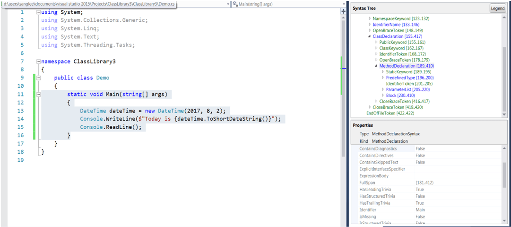

# Capgemini Core C# Code Analyzers

## Content
 - [Introduction](#introduction)
 - [Installation](#installation)
 - [Implementation](#implementation)
 - [Deployment](#deployment)
 - [Usage](#usage)
 
----
Current build status:  

----
## Introduction
A compiler is a program which translates the source code into the executable code.

It also detects syntax and semantic error and it used to be a black-box operation.

However, the Microsoft .NET compiler platform ("Roslyn") has variety of code analysis API which could be extended into the existing compiler to make own custom code analysis program.

----
## Usage

Capgemini IP code analyzer enforces the following rules

1. CommentsAnalyzer - Enforces that excessive amounts of comments are added to variables
2. ExplicitAccessModifiersAnalyzer - Enforces that methods, types and variables have explicit modifiers
3. FileHierarchyAnalyzer - Enforces that namespaces align with file hierarchy structure
4. GodClassAnalyzer - Enforces that no class contains more than 20 methods 
5. HardCodeAnalyzer - Enforces that literal strings are not part of the general code but moved into constants.
6. IfStatementAnalyzer - Enforces that all If statements are guarded by curly braces
7. LargeCommentedCodeAnalyzer - Enforces that excessive amounts of comments are added to any part of the code base
8. LoopStatementAnalyzer - Enforces that all loop statements are guarded by curly braces
9. MethodComplexityAnalyzer - Enforces that no method's cyclomatic complexity is greater than 15
10. MonsterMethodAnalyzer - Enforces that no method has more than 80 executable lines of code
11. NamingConventionAnalyzer - Enforces that all artifacts within the code base are named according to predefined patterns
12. OneTypePerFileAnalyzer - Enforces that only one type is defined within a C# file
13. StaticClassAnalyzer - Enforces that static classes are not used unless absolutely required
14. XmlCommentsAnalyzer - Identifies public methods which do not have valid comments
15. ConstructorParametersAnalyzer - Identifies constructors with > 5 parameters (Warning) and >= 10 (Error)

----
## Installation
In order to write custom code analyzers, refactoring, and stand-alone .NET applications that utilizes the Roslyn APIs, you need to install the **.NET Compiler Platform SDK.**

Open Visual Studio 2015 -> Select **Tools** > **Extensions and Updates**. In the Extensions and Updates dialog box,select On-line on the left, and then in the search box, type 
**.NET Compiler Platform SDK.**

For more information about [Roslyn click this link](https://msdn.microsoft.com/en-us/library/mt162308.aspx "Roslyn")

----
## Implementation
It is critical for the DevOps team to communicate well with other scrum teams to gather the right code analysis logics and implement correctly to maintain the good coding standard.

In order to create custom code analysis program, you have to investigate the syntax of the code which will be analyzed. This can be done by using *Syntax visualizer*.

The **Syntax Visualizer** can be enabled via **View** > **Other Windows** > **Syntax visualizer**

### Syntax Visualizer 

Syntax visualizer allows you to inspect the syntax tree by the .NET platform "Roslyn"



### Implementing the Analysis Logic

The analysis logic requires two fundamental steps:

1. Write a method that will perform the code analysis over a given syntax node
2. Register the action at the  analyzer's startup so that the analyzer can respond to compiler events

### Method used to register action

**RegisterSyntaxNodeAction** - Register an action that is executed at the completion of the semantic analysis of a syntax node.

*Example*
```c#
public override void Initialize(AnalysisContext context)
{
    context.RegisterSyntaxNodeAction(MethodName, SyntaxKind.IdentifierName);
}
```

```c#
private void MethodName(SyntaxNodeAnalysisContext context)
{
    var root = context.Node;
    //Code analysis logic implementation

    //Create a diagnostic at the node location
    var diagnostics = Diagnostics.Create(Rule, root.GetLocation(), message);
    context.ReportDiagnostic(diagnostics);
}
```
----
## Deployment
Once the code analysis logics are implemented and tested, the project will produce an analyzer .dll, as well as the

1. A NuGet Package(.nupkg file) which will add your assembly as a project-local analyzer that  participates in builds
2. A VSIX extension(.vsix file) that will apply your analyzer to all projects and works just in the IDE

### Applying your NuGet Package

1. Create a local NuGet feed
2. Copy the .nukpg file into that folder
3. Right-click on the project node in Solution Explorer and choose Mange NuGet Packages
4. Select the NuGet feed you created on the left 
5. Choose your analyzer from the list and click install

Note: Capgemini.CodeAnalysis is currently integrated into a continuous integration pipeline in VSTS which generates associated [nugget packages](https://capgeminiuk.visualstudio.com/Capgemini%20Reusable%20IP/Capgemini%20Reusable%20IP%20Team/_packaging?feed=CapgeminiIp&_a=feed "nugget packages").

Currently, we have the following code analyzers:
1. **Capgemini.CodeAnalysis.CoreAnalysers** - Contains analyzers that are applicable to any C# code bases
2. **Capgemini.CodeAnalysis.XrmAnalysers** - Contains analyzers that are designed to enforce rules that are applicable to CRM code bases

These packages can be consumed by adding the [Capgemini NuGet Feed](https://capgeminiuk.pkgs.visualstudio.com/_packaging/CapgeminiIp/nuget/v3/index.json "Capgemini NuGet Feed") to the NuGet config of the target C# solution
